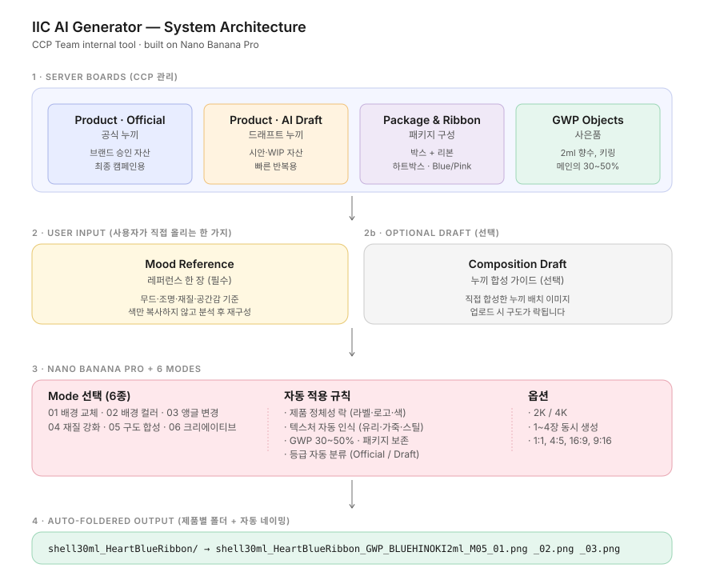

# IIC AI Generator — 시스템 개요

> 이 문서는 비개발자/경영진을 위한 시스템 구조 설명서입니다.
> 기술 디테일은 `README.md` 참조.

---

## 시스템 구조 한 장



---

## 한 줄 요약

**서버에 모인 누끼·미학 라이브러리에서 자산을 골라, 사용자가 올린 레퍼런스 한 장과 합성해, IIC 미학 기준의 무드컷을 자동 생성하는 도구.**

---

## 시스템 흐름

```
[1] 서버 보드 (CCP 관리)
       ↓
   ┌── Product / Official  · 공식 누끼
   ├── Product / AI Draft  · 드래프트 누끼
   ├── Package & Ribbon    · 박스+리본 패키지
   └── GWP Objects         · 사은품

       ↓ 사용자가 보드에서 클릭으로 선택

[2] 사용자 업로드 (1장만)
   └── Mood Reference      · 무드 레퍼런스

       ↓

[3] 모드 선택 (6종)
   01 배경 교체  /  02 배경 컬러  /  03 앵글 변경
   04 재질 강화  /  05 구도 합성  /  06 크리에이티브

       ↓

[4] Nano Banana Pro 생성
   · 제품 정체성 락 (로고·라벨·재질 보존)
   · 텍스처 자동 인식 (유리·가죽·스틸 등)
   · GWP는 메인 제품의 30~50% 크기로 자동 배치
   · 패키지 구성 그대로 보존

       ↓

[5] 자동 폴더링 + 자동 네이밍
   shell30ml_HeartBlueRibbon/
   ├── shell30ml_HeartBlueRibbon_GWP_BLUEHINOKI2ml_M05_01.png
   ├── shell30ml_HeartBlueRibbon_GWP_BLUEHINOKI2ml_M05_02.png
   └── ...
```

---

## 핵심 차별점

### 1. 누끼는 두 등급으로 분리

| 등급 | 용도 | 표시 |
|------|------|------|
| **Official** | 브랜드 승인 완료된 공식 누끼. 최종 캠페인용. | 초록 OFFICIAL 배지 |
| **AI Draft** | AI 생성 또는 작업 중 누끼. 빠른 시안용. | 주황 DRAFT 배지 |

→ 최종 결과물에 어떤 등급의 누끼가 쓰였는지 자동으로 파일명에 기록됩니다.

### 2. GWP는 무조건 서브로

GWP(사은품)는 절대 메인 제품과 시각적 경쟁을 못 하도록, 프롬프트 레벨에서 다음 규칙이 강제됩니다:

- GWP 크기는 메인 제품의 30~50%
- 위치는 옆 또는 뒤
- 시각적 무게(contrast, lighting)도 줄여서 배치

### 3. 패키지 = 박스 + 리본 조합

핑크 리본, 블루 리본 등은 캠페인 이름이 아니라 패키지 구성입니다. 시스템도 그대로 반영:

- `package` 보드 = `하트박스 + 블루리본`, `하트박스 + 핑크리본` 등의 조합으로 분류
- 자동 폴더명에 패키지 정보 반영: `shell30ml_HeartBlueRibbon/`

### 4. 사용자는 레퍼런스만 직접 올림

기존 방식: 사용자가 제품·GWP·레퍼런스 다 직접 업로드
→ 매번 같은 누끼 다시 올려야 함, 등급 구분 안 됨

새 방식: 제품·패키지·GWP는 서버 보드에서 클릭으로 선택, 레퍼런스만 직접 업로드
→ 자산 일관성 보장, AI 학습 누적, 등급 자동 분류

---

## 6 모드 — 언제 어떤 모드?

| 모드 | 사용 시점 | 결과 |
|------|----------|------|
| **01 배경 교체** | 누끼 합성 드래프트 → 배경만 자연스럽게 | 구도 동일, 배경만 새 무드 |
| **02 배경 컬러** | 같은 사진 색감만 살짝 바꾸고 싶을 때 | 컬러만 변경 |
| **03 앵글 변경** | 향수 한 컷을 다양한 각도로 | 단일 제품, 카메라 변형 |
| **04 재질 강화** | 향수 유리 질감 보정 | 각도 유지, 머터리얼만 업그레이드 |
| **05 구도 합성** | 좋은 레퍼런스의 구도를 우리 제품에 | 제품 락 + 레퍼런스 구도 |
| **06 크리에이티브** | 자유로운 무드컷 재해석 | 제품 락 + 무드 자유 |

---

## 백엔드에서 해야 할 일

### 1. Gemini API 키 등록 (5분)
- AI Studio에서 키 발급 → Vercel 환경변수 등록
- 이것만 하면 사이트는 즉시 작동

### 2. 서버 보드 자산 연결 (1~2일)
- 4개 보드에 자산 데이터 공급
- `api/boards.js` 수정해서 다음 중 한 가지로 연결:
  - **JSON 파일** (가장 빠름)
  - **데이터베이스 쿼리**
  - **Google Drive / Dropbox 폴더**

상세는 `api/boards.js` 상단 주석 참조.

---

## 자산 관리 원칙 (CCP 팀)

서버 보드는 CCP 팀이 관리합니다. 자산 추가/수정 권한이 명확해야 일관성이 유지돼요.

**제안 운영 방식:**
- 매주 신제품 누끼가 들어오면 → `product-official` 보드에 추가
- AI로 빠르게 만든 시안 누끼 → `product-draft` 보드 (영구 보관 X, 시안용)
- 새 패키지 조합 (예: 새 시즌 박스/리본) → `package` 보드
- 신규 GWP → `gwp` 보드

각 자산엔 `label` (사람이 읽을 이름)과 `id` (시스템용 고유 키)를 부여합니다.

---

## 결과물 산출 경로

```
사용자 클릭 GENERATE
   ↓ (1~2분)
브라우저에 결과 표시
   ↓ DOWNLOAD FOLDER 클릭
PC 다운로드 폴더에 자동 저장
   파일명: shell30ml_HeartBlueRibbon__shell30ml_HeartBlueRibbon_GWP_M05_01.png
```

→ 향후 확장: Google Drive 직접 업로드, Notion DB 연동 등 가능

---

## 다음 단계

- [ ] **Phase 1 (지금)**: 프론트엔드 + Gemini 연결 — 완료
- [ ] **Phase 2 (다음)**: 서버 보드 자산 라이브러리 구축 (백엔드 작업)
- [ ] **Phase 3**: 자산 업로드 어드민 페이지 (CCP 팀용)
- [ ] **Phase 4**: 결과물 Google Drive / Notion 자동 업로드
- [ ] **Phase 5**: 사용 통계, 즐겨찾기, 버전 관리
